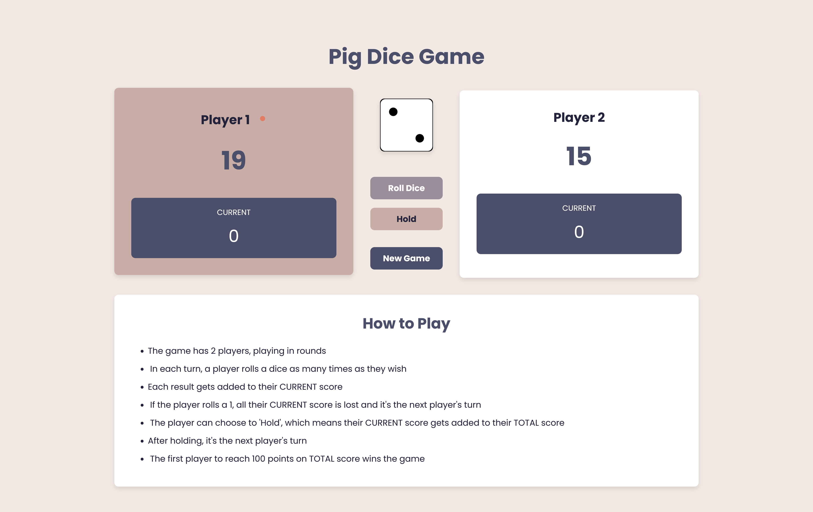

# 🎲 Pig Dice Game 🎲

Welcome to the **Pig Dice Game**, a simple and fun two-player dice game where the goal is to be the first to reach **100 points**. Players roll dice and accumulate points but have to be careful! Rolling a **1** will lose all their current points for that turn. The game features a "Hold" option, where players can lock in their points for the turn and pass the dice to the other player.

## 🕹️ How to Play

1. Two players take turns rolling the dice.
2. On each turn, a player can roll the dice as many times as they wish.
3. Every roll adds to the player's current score for that turn.
4. If a player rolls a **1**, their current score for the turn is lost, and it's the other player's turn.
5. A player can "Hold" at any time to add their current score to their total score and pass the dice to the other player.
6. The first player to reach **100 points** wins the game! 🎉

## 💻 Tech Stack

- **HTML5**
- **CSS3**
- **JavaScript**

## 📦 Installation

To get the **Pig Dice Game** up and running on your machine:

1. **Clone** this repository:

   ```bash
   git clone https://github.com/your-username/pig-dice-game.git
   ```

2. **Navigate** to the project directory:

   ```bash
   cd pig-dice-game
   ```

3. **Open** the `index.html` file in your browser:
   ```bash
   open index.html
   ```

## 🎮 Features

- 🎲 **Roll the Dice**: Click to roll a virtual die and see what number you get!
- 💥 **Current Score**: Keep track of the score for the current turn.
- 🏆 **Hold**: Choose to hold your score and pass the turn to the other player.
- 🔄 **New Game**: Start a fresh game with a click of a button.
- 🎉 **Winner Display**: The first player to reach **100** points wins and is highlighted!

## 🔧 Game Controls

- **Roll Dice**: Click the **Roll Dice** button to roll the die.
- **Hold**: Click the **Hold** button to lock in your current score and pass the turn to the other player.
- **New Game**: Click the **New Game** button to start a new game.

## 🤖 How It Works (JavaScript Logic)

The game keeps track of two players and their scores. The main features are:

1. **Roll Dice**: A random number between 1 and 6 is generated when the dice is rolled. If the number is 1, the current score for that player is reset, and the turn ends.
2. **Hold**: The player's current score is added to their total score, and the turn passes to the other player.
3. **Switch Player**: When a player’s turn is over (either by rolling a 1 or choosing to hold), the active player changes.
4. **Win Condition**: The game ends when a player reaches or exceeds 100 points.

## 🖌️ Preview

Here is a preview of the app:



## 📝 Notes

- 🎲 Dice images are rendered using SVG data URIs for fast loading.
- 🛠️ Feel free to modify and improve the game logic, add new features, or change the design as you like.

## 🎉 Enjoy the Game!

Let the dice roll!
